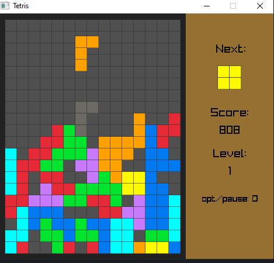
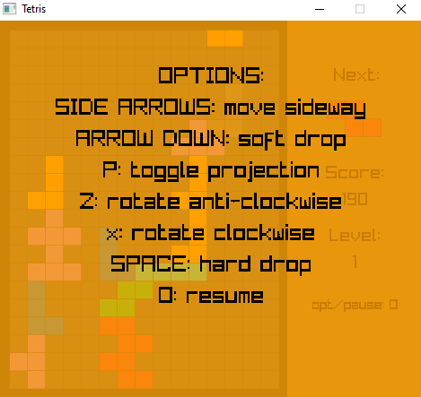

# Tetris game made with raylib library

  

## Prerequisites
- Cmake, min version 3.14

## Build:
Tested with windows/MSVC, but it's generic build process for cmake - should also work for other platforms:
- git clone https://github.com/mako542b/tetris
- cd tetris
- mkdir build
- cd build
- cmake ..
- cmake --build . --config Release
